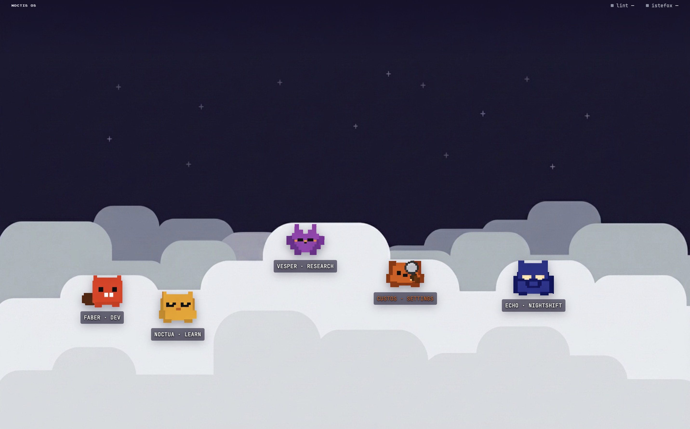
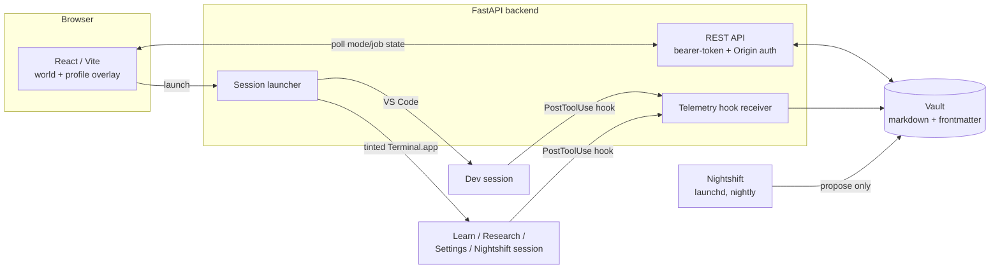

<p align="center">
  
</p>

<h1 align="center">Noctis OS</h1>

<p align="center">
  A harness that shapes how Claude works for me — five modes, one compounding knowledge graph.
</p>

<p align="center">
  
  
  
</p>

---

## What this is

Noctis OS is a harness that shapes how Claude works for me: five modes — build, learn, research, maintain, and an overnight auditor — that all read and write into one compounding knowledge graph, instead of five disconnected chats that each start from zero. It's loosely inspired by Andrej Karpathy's pattern of an LLM-maintained wiki: a durable, structured store that sessions read from and write back into, rather than context that evaporates when the chat closes.

It's deliberately never a finished system. The mode boundary is there so new modes, tools, and models can keep getting absorbed as the space moves, without the whole thing needing a rewrite each time something changes — the same reason it's a harness and not a fixed app.

Concretely: a persistent pixel-art "world" with five characters idling on a dusk backdrop (the screenshot above is the real thing, not a mockup). Each character is a mode with its own methodology, working context, and subagents, all reading and writing the same vault. Click one, see its live state (what's in flight, what's overdue, what's staged for review), and hit launch — that spins up a real Claude Code session in the right surface (VS Code for building, a color-tinted Terminal window for everything else) with that mode's methodology, lessons, and current job context already loaded.

| Character | Mode | What it's for |
|---|---|---|
|  **Faber** | Dev — *build* | Spec → build → ship, the full process gate (plan, implement, review, deploy) |
|  **Noctua** | Learn | Structured study sessions with spaced review |
|  **Vesper** | Research | Sourcing, credibility-checking, and synthesizing findings into durable notes |
|  **Custos** | Settings — *maintain* | Health checks, drift audits, and staged methodology changes for the other four modes |
|  **Echo** | Nightshift — *auditor* | Scheduled, propose-only overnight runs — reviewed and accepted/rejected by hand the next morning |

I use it daily. It's a single-user, single-machine tool — there's no deployment story here by design (see [Architecture](#architecture)). I built it because I was running enough different kinds of Claude Code sessions that "which context do I need to load this time" had become its own daily chore, and wanted mode-switching to be a click instead of a memory exercise. It improves itself over time through proposals I review — never silent changes (see [Two-tier self-improvement](#highlights) below).

## Where this came from

Before Noctis OS, I had one universal `CLAUDE.md` — a single build process file (internally called the "build-spine") that every Claude Code session read, regardless of whether I was actually building software, reading a paper, or triaging settings. It worked fine for dev work and was actively wrong for everything else: a research session would load an entire spec/plan/ship pipeline it had no use for.

The migration was to generalize that one file into five: `build-spine.md` became `modes/dev/dev.md`, and four siblings (`learn.md`, `research.md`, `settings.md`, `nightshift.md`) were written alongside it, each its own methodology rather than a cut-down copy of the dev process. The mechanism that makes this actually stick per-session is `CLAUDE_CONFIG_DIR` — an undocumented-but-respected Claude Code environment variable. Dev-mode launches (and any ad hoc terminal use) still read the global default and get the full build process; the other four modes launch with `CLAUDE_CONFIG_DIR` pointed at a minimal, mode-scoped config instead, so a Learn session never inherits Dev's spec-and-ship machinery. One process file turned into five, each addressable independently, without touching how the others load.

## Highlights

- **Per-mode methodology injection.** Every launch assembles that mode's process file + its accumulating lessons file + the specific job's working context into one preloaded session — the orchestration layer that makes each character behave differently.
- **A markdown vault as the only database.** No Postgres, no ORM, no migrations. The backend reads and writes frontmatter'd markdown files directly; state is always inspectable and versionable with plain git.
- **Two-tier self-improvement.** Sessions freely append to a mode's lessons file with no gate (the automatic, low-stakes tier). Periodically, Custos digests those lessons and drafts a *proposed* diff to a mode's actual methodology file, staged for manual accept/reject — no mode ever silently rewrites its own process.
- **Fire-and-forget session telemetry.** A Claude Code hook appends one line per tool call to a per-job log; the interface polls it and shows a live "what's it doing right now" strip under each in-flight job — without the interface ever trying to control or interrupt a running session.
- **A propose-only overnight worker.** Nightshift runs on a schedule, drafts into a staging inbox, and never commits anything itself — every proposal gets reviewed and explicitly accepted or rejected.
- **The hero image above is a real screenshot**, not a mockup or a composite — that's the actual world screen, live backend state and all.

## Architecture

Two local processes and a filesystem — nothing deployed, nothing multi-tenant:



- **Backend** — FastAPI, fully stateless. No ORM, no migrations; every endpoint reads or writes vault files on disk and returns state. Auth is bearer-token + Origin checking on every route except `/health`.
- **Frontend** — React + Vite + TypeScript + Tailwind. Polls mode/job state every 15s and renders it as ambient badges — no invented UI-only state, everything shown is a rendering of something the vault already tracks.
- **Vault** — a folder of markdown files with YAML frontmatter, one folder per mode (`modes/<name>/{<name>.md, lessons.md, state.md, jobs/, agents/}`). This is the single source of truth; the backend never holds state the vault doesn't also have. No database also means no migration story to worry about: moving to a new machine is clone the repo, point `VAULT_PATH` at the vault, `make setup` — not a project.
- **Session launcher** — Dev opens VS Code (reads the default global Claude Code config); the other four modes open a character-tinted `Terminal.app` window with `CLAUDE_CONFIG_DIR` pointed at a minimal, mode-scoped config so those sessions never inherit Dev's full build process.
- **Telemetry** — a Claude Code `PostToolUse` hook appends one line per tool call to a per-job runtime log (not the vault — high-churn, ephemeral, gitignored). The interface tails that log for the live action strip.
- **Nightshift** — a `launchd`-scheduled job that proposes work into a staging inbox only. Nothing it produces is committed without a human explicitly accepting it in Echo's profile overlay.
- **Desktop wrapper** — `desktop/NoctisOS.app` is a real double-clickable macOS app (`pywebview`), but a thin window around the same live source — a code change just needs the app's own Refresh command, never a rebuild.

## Tech stack

| Layer | Choice |
|---|---|
| Frontend | React 19, TypeScript, Vite, Tailwind CSS 4 |
| Backend | FastAPI, Python 3.11, `python-frontmatter` |
| Storage | Flat markdown + YAML frontmatter (no database) |
| Desktop shell | `pywebview` |
| Scheduling | macOS `launchd` |
| Session runtime | [Claude Code](https://claude.com/claude-code) (CLI), driven via its hooks and per-session config |
| Testing | `pytest` (backend, 37+ tests covering auth, vault I/O, and every router) |

## Running it locally

Requires macOS, Python 3.11+, Node 18+, and the [Claude Code CLI](https://claude.com/claude-code) installed and logged in.

```bash
git clone https://github.com/shaynesss/noctis-os.git
cd noctis-os
make setup     # installs backend + frontend deps, copies .env.example -> .env
```

Fill in `.env` — `VAULT_PATH` (absolute path to a vault folder on your machine) and `NOCTIS_API_TOKEN` (any local secret string; it just has to match between backend and frontend).

```bash
make dev       # backend (FastAPI, :8000) + frontend (Vite, :5173), browser tab
make open-app  # same thing, opened as a native macOS window instead
```

See [`SETUP.md`](SETUP.md) for the one-time machine checklist (Claude Code login, the nightshift `launchd` job, and a VS Code setting the Dev launch surface needs).

> **Heads up:** this is a genuinely single-user tool — the vault path, launch surfaces, and mode folders all assume it's pointed at *your* Claude Code setup on *your* machine. It's public as a working example of the architecture, not as something meant to run multi-tenant or be deployed anywhere.

## Project layout

```
noctis-os/
├── backend/          FastAPI app — routers, auth, vault I/O, hooks, tests
├── frontend/          React/Vite app — world screen, profile overlays
├── desktop/           pywebview native-window wrapper
├── assets/            Character sprites + world backdrop (source of truth for both apps)
├── launchd/            Nightshift's scheduled-job plist
├── scripts/            setup.sh, nightshift_run.sh
├── SPEC.md            Full spec: Definition / PRD / Technical Design / Design Brief
├── STATUS.md          Live build state — what's shipped, what's smoke-tested
└── SETUP.md           One-time machine setup checklist
```

## Status

**v1 shipped.** All five modes are wired to real vault reads/writes, session launching works end-to-end for both surfaces (VS Code and tinted Terminal windows), telemetry hooks stream live action logs into the interface, and Nightshift's propose-only inbox is functional. Two full review passes (correctness + security) have been run against the codebase. See [`STATUS.md`](STATUS.md) for the detailed, non-aspirational build log.

**Deliberately out of scope for v1:** multi-user support or auth beyond a single bearer token, any hosted deployment, cross-vendor model routing (Claude-only for now), idle character animation/roaming, and a full expression-swap library beyond the current busy/idle pair per character.

## License

[MIT](LICENSE) — see the license file for details.
