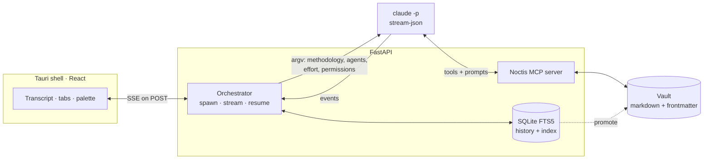
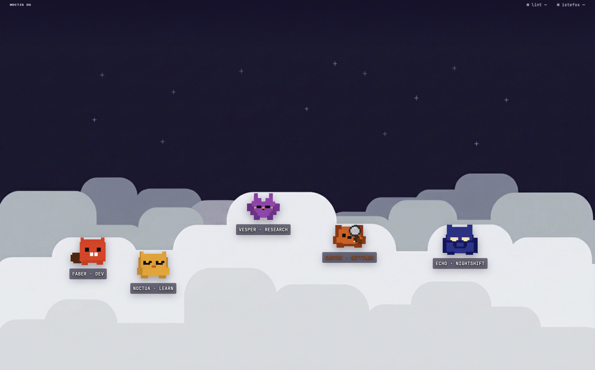

<h1 align="center">Noctis OS</h1>

<p align="center">
  A desktop client for Claude Code, shaped around five modes and one compounding vault.
</p>

<p align="center">
  
  
  
</p>

---

## What this is

Noctis OS **hosts** Claude Code sessions rather than launching them somewhere else. It drives the CLI as a subprocess, streams its output into its own transcript, and gives each session a **mode** — a methodology, a job context, and a set of subagents, all read from and written back to one markdown vault.

Five modes, and they differ by *method*, never by capability:

| Mode | For | Model |
|---|---|---|
| **General** | Questions, comparisons, anything unscoped | Opus 5 |
| **Faber** | Build: spec, implement, ship | Opus 5 |
| **Noctua** | Learn: read closely, explain, retain | Opus 5 |
| **Vesper** | Research: gather, weigh, return a verdict | Opus 5 |
| **Maintenance** | Audit the vault and propose repairs | Haiku 4.5 |

It runs on an existing Claude subscription with no API billing — a constraint that shapes the whole architecture. Single-user, single-machine, public as a working example of the architecture rather than as something to deploy.

## Why it exists

Before this, a single universal `CLAUDE.md` — a build process — was read by every session, whether the work was building software, reading a paper, or triaging notes. Correct for dev, actively wrong for everything else: a research session loaded an entire spec-and-ship pipeline it had no use for.

**v1** solved that by generalising one process file into five and launching each mode into a separate surface — VS Code for dev, a colour-tinted Terminal window for the rest — then reading state back from the vault. Fire-and-forget: the interface could start a session and watch its telemetry, but never see the conversation.

**v2 is the consequence.** Launching *into* other applications meant Claude Desktop stayed the real entry point, and three things were impossible by construction: live session monitoring, cross-mode search, and durable conversation history. So the app hosts sessions itself.

## How it works


```mermaid
flowchart LR
    subgraph Shell[Tauri shell · React]
        UI[Transcript · tabs · palette]
    end

    subgraph Backend[FastAPI]
        Orch[Orchestrator<br/>spawn · stream · resume]
        MCP[Noctis MCP server]
        Store[(SQLite FTS5<br/>history + index)]
    end

    Vault[(Vault<br/>markdown + frontmatter)]
    CC[claude -p<br/>stream-json]

    UI <-->|SSE on POST| Orch
    Orch -->|argv: methodology, agents,<br/>effort, permissions| CC
    CC -->|events| Orch
    CC <-->|tools + prompts| MCP
    MCP <--> Vault
    Orch <--> Store
    Store -.->|promote| Vault
```

**The orchestrator** spawns `claude -p --output-format stream-json`, parses the stream into a normalised event union, and streams that to the shell. Two concurrent sessions, queued rather than refused — the cap is a budget on the 5-hour window, not a resource limit. Sessions resume by engine session id, so a follow-up turn continues the same conversation and closing the window loses nothing.

**A mode is passed in, never inherited.** Its methodology travels in the argv via `--append-system-prompt`, its subagents via `--agents`, its permissions and telemetry hooks via `--settings`. Nothing per-mode is written to disk, so two sessions of one mode cannot race on a config file — and an edited methodology reaches a session that is already running.

**Sessions run against the real `~/.claude`.** They inherit every installed plugin, skill, subagent, MCP server, accumulated permission and memory — the same surface an ordinary Claude Code session has. This was not true until September 2026, and the difference was large: see [What changed](#what-changed).

**The Noctis MCP server** serves both MCP primitives. `tools/*` gives retrieval — `vault_search`, `history_search`, `job_context`, `worklist`, `propose` — over BM25 via SQLite FTS5, measured at 80% recall@20. `prompts/*` gives *identity*: `enter_faber` and its siblings load a mode's methodology and job context. Dependency-free stdio JSON-RPC, so any MCP client can speak to it.

**The vault is the only database** for anything durable — a folder of markdown files with YAML frontmatter, one directory per mode. No ORM, no migrations; moving machines is clone, point `VAULT_PATH`, `make setup`. SQLite holds conversation history and the search index: machine state, deliberately not vault state, with an explicit `promote()` for anything that earns a place in the vault.

## What v2 does that v1 could not

- **Live transcripts.** Every turn renders as it streams — text, tool calls with their targets, thinking-token counts during a pause, real usage against the subscription window.
- **Durable history.** Conversations restore on launch. `⌘K` searches across every mode's history.
- **Mode entry and handoff.** `⌘T` opens a session in any mode; `⌘⇧H` hands the current one over, carrying a summary rather than the transcript — the new session gets what it needs, not everything that came before.
- **Effort as a control.** The composer chip cycles `low`/`medium`/`high`/`xhigh`, applied to the next turn — which is immediate, since every turn is its own spawn.
- **Permission requests you can answer.** A request surfaces as a dialog in the app and waits for a decision.
- **Silence and refusal are visible.** A turn ending with tool calls and no text renders as *"turn ended with no reply"*; one refused its tools renders as *"turn ended blocked"*, with the refusals named. A blank transcript used to be indistinguishable from a crash.
- **A capability contract.** Each mode declares what its methodology assumes it can reach, the harness reports what it actually has, and `make doctor` prints the gap.

## What carries over from v1

Still running, unchanged in intent:

- **Two-tier self-improvement.** Sessions append freely to a mode's `lessons.md`, no gate. Periodically, maintenance digests those lessons and drafts a *proposed* diff to the methodology itself, staged for manual accept or reject. No mode silently rewrites its own process.
- **A propose-only overnight worker.** Runs on `launchd`, drafts into a staging inbox, commits nothing. Every proposal is accepted or rejected by hand.
- **Design Lodge.** A vault-native catalog of design assets — components, palettes, typography, motion — checked before Faber reaches for anything new, with a quick-capture inbox sorted opportunistically at the start of a dev session.
- **Telemetry hooks.** One line per tool call to a per-job runtime log (gitignored, not vault content), plus a session-end hook that clears the busy flag.

<p align="center">
  
  <br/>
  <em>v1's world screen — a real screenshot, and now the launcher rather than the app. v2's shell is a transcript; a screenshot of it is owed.</em>
</p>

## What changed

The architecture through mid-2026 differed from what is here now. If you are reading older commits or docs, this is the delta:

| Was | Is |
|---|---|
| Sessions launched into VS Code and Terminal.app, state read back from the vault | The app hosts sessions and streams them into its own transcript |
| Each mode had its own `CLAUDE_CONFIG_DIR` under `backend/launch_config/` | No redirect anywhere. Sessions use the real `~/.claude`, inheriting plugins, skills, subagents, MCP servers, permissions and memory |
| A mode's methodology was written into that dir's `CLAUDE.md` on every launch | Passed per launch via `--append-system-prompt`. Nothing per-mode on disk, so concurrent sessions cannot race |
| `~/.claude/CLAUDE.md` symlinked to `modes/dev/dev.md` | Symlinks to `prompts/system.md`. The config root is infrastructure, never an identity — the old symlink made the machine itself Faber and leaked the build process into every other mode |
| Per-mode tool cages (`--disallowedTools`) restricted research and maintenance | Every mode gets the same tools. `git push` stays denied for all of them |
| Permission prompts were emitted with nothing attached to answer them | Answered by the Noctis MCP server, surfaced as a dialog |
| The composer chip cycled the permission mode | It cycles effort, which `dev.md` had specified since it was written while no code passed `--effort` |
| The MCP server was built but never attached to a spawn | Attached to every spawn; `vault_search` and the `enter_<mode>` prompts are reachable |
| Five characters, Custos and Echo among them | Settings and Nightshift collapsed into root-level `maintenance/` — infrastructure rather than a mode — and General was added |
| `make test` ran backend tests only | Runs backend, frontend typecheck and frontend tests. `make doctor` reports what is up, what is down, and any capability gaps |

Reasoning for each is in [`CHANGELOG.md`](CHANGELOG.md) and the commit messages.

## Portability

"Workflow agnostic" here means something specific: **not that everything survives a move to another harness, but that a move states what it costs.**

- **Portable because it is text** — the methodology, mode overlays, agent definitions, the vault.
- **Portable because MCP is the standard** — retrieval *and* mode-loading both travel over `tools/*` and `prompts/*`. Any MCP client gets them.
- **Not portable** — permissions, hooks, spawn flags, event-stream shape. Confined to three files under the `orchestrator/events.py` seam.

`python -m capabilities --migrate` emits a brief describing that third tier as *intent* rather than as settings, for an agent in another harness to act on. A multi-harness adapter is deliberately deferred: there is one harness, and an abstraction with a single implementation encodes guesses about the second rather than knowledge of it. See the *Harness portability* section of [`SPEC.md`](SPEC.md).

**On subscriptions.** Noctis is already bring-your-own-subscription — it drives the vendor's own CLI rather than calling an API with a key, so `Usage.list_cost_usd` is notional and `Limits` reports the 5-hour and 7-day windows rather than dollars. The metered-API objection was about the API path and does not carry over. Extending the same mechanism to other providers is not blocked by licensing: each ships a CLI that authenticates against its own subscription. It is blocked by N× driver and parser, each drifting independently — the same integration surface that makes the adapter premature. Provider terms differ on scale, sharing and resale; personal single-seat use is the intended path and anything past it needs the actual terms read.

## Tech stack

| Layer | Choice |
|---|---|
| Shell | Tauri 2, React 19, TypeScript, Vite, Tailwind CSS 4 |
| Backend | FastAPI, Python 3.11, `python-frontmatter` |
| Session runtime | [Claude Code](https://claude.com/claude-code) CLI, driven as a subprocess |
| Durable state | Flat markdown + YAML frontmatter (the vault) |
| History + search | SQLite FTS5 (BM25), no added dependencies |
| Scheduling | macOS `launchd` |
| Testing | `pytest` + `vitest` + `tsc -b`, all via `make test` |

## Running it locally

Requires macOS, Python 3.11+, Node 18+, and the [Claude Code CLI](https://claude.com/claude-code) installed and logged in.

```bash
git clone https://github.com/shaynesss/noctis-os.git
cd noctis-os
make setup     # backend + frontend deps, .env.example -> .env
```

Fill in `.env` — `VAULT_PATH` (absolute path to your vault) and `NOCTIS_API_TOKEN` (any local secret; it only has to match between backend and frontend).

```bash
make dev       # backend :8000 + frontend :5180
make doctor    # what is up, what is down, and any capability gaps
make test      # pytest + tsc -b + vitest
```

See [`SETUP.md`](SETUP.md) for the one-time machine checklist.

> **Heads up:** genuinely single-user. The vault path and mode folders assume they point at *your* Claude Code setup on *your* machine.

## Project layout

```
noctis-os/
├── backend/
│   ├── orchestrator/    Spawn, stream, parse, resume — driver, events, parser, store
│   ├── mcp/             Noctis MCP server (stdio JSON-RPC, dependency-free)
│   ├── retrieval/       BM25 index over the vault, measured
│   ├── routers/         REST + SSE endpoints
│   ├── prompts/         Composes system.md + mode overlay + job context
│   ├── capabilities.py  What each mode needs vs. what the harness has
│   └── jobs.py          Mode → vault paths, job lookup
├── frontend/src/shell/  The v2 client — transcript, tabs, palette, panels
├── frontend/src-tauri/  Native shell
├── assets/              Character sprites (source of truth for both apps)
├── SPEC.md              Definition / PRD / Technical Design / Design Brief
├── STATUS.md            Live build state, non-aspirational
└── CHANGELOG.md         What changed when, and why
```

## Status

**v1.5.2 is shipped and still the working system. v2 is mid-build.**

Stage 1 complete. Stage 2: items 1–5 and 7 done and verified live; item 6 done except its `launchd`-on-wake scheduler; item 8 needs a definition before it can be built; item 9 (maintenance migration) is unblocked and not started.

Working end to end today: the orchestrator, the MCP server, and a shell with chat, mode entry, handoff, search, live monitoring and real usage stats.

**The two versions coexist on purpose.** `frontend/src/shell/` is what runs; v1's `World.tsx`, `ProfileOverlay.tsx` and the VS Code / Terminal launch routes are still in the tree, unreferenced, and go at the Stage 2 cutover together with the state that still lives at their paths. Removing them before then would take working v1 behaviour offline to tidy a directory.

[`docs/noctis-documentation.md`](docs/noctis-documentation.md) is the short read. [`STATUS.md`](STATUS.md) is the detailed, non-aspirational build log.

**Deliberately out of scope:** multi-user support or auth beyond a single bearer token, any hosted deployment, idle character animation, and a full expression-swap library beyond the current busy/idle pair.

## License

[MIT](LICENSE) — see the license file for details.
