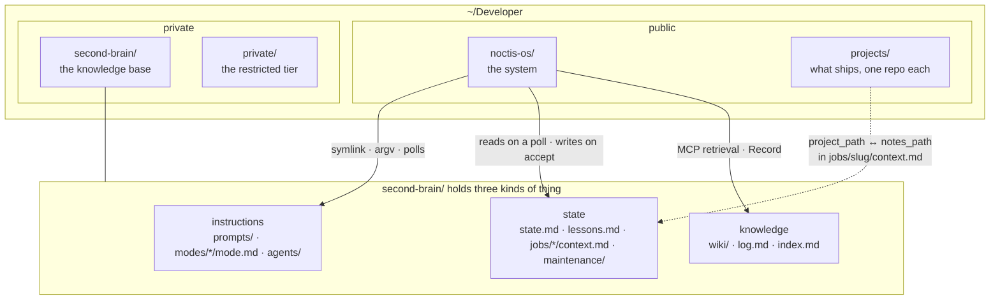

<h1 align="center">Noctis</h1>

<p align="center">
  <b>I rewired the way I work.</b>
</p>

<p align="center">
  
  
  
</p>

Noctis is a personal system in two halves. A **brain**: a folder of plain markdown that any model can read, with a standard protocol in front of it. A **body**: an app that runs AI sessions against that folder. Today the body hosts the Claude Code CLI. Swap it for something else and the brain keeps everything it learned.

> [!WARNING]
> Sessions run with `Bash`, `Edit` and `Write` pre-approved, against your project and your vault. Keep both in git. See [Blast radius](#blast-radius).

## The idea

A chat session is disposable. You close the window and the thinking is gone. The next session starts from zero, and you explain everything again.

Noctis splits that problem into two halves that age differently.

The **brain** lasts. It is a directory tree on disk: decisions and their reasons, the state of every job, the method each kind of work follows. Nothing in it belongs to a vendor. It reads the same in a text editor, in Obsidian, or through any tool that speaks MCP.

The **body** is a vessel. It is whatever runs the sessions right now, and it is built to be replaced. The interface is the cheap half; the folder is the expensive one. So the folder is designed to outlive the app.

That is the whole design. Everything below is one half or the other, and then the seam where they meet.

## The brain: a file system

Noctis relies on one directory tree, `~/Developer`. The line at the root is who may see it: two folders push to GitHub, two never leave the machine.


```mermaid
flowchart TB
    subgraph DEV["~/Developer"]
        direction LR
        subgraph PUB["public"]
            NOS["noctis-os/<br/>the system"]
            PRJ["projects/<br/>what ships, one repo each"]
        end
        subgraph PRV["private"]
            SB["second-brain/<br/>the knowledge base"]
            PV["private/<br/>the restricted tier"]
        end
    end
    subgraph SBI["second-brain/ holds three kinds of thing"]
        direction LR
        INS["instructions<br/>prompts/ · modes/*/mode.md · agents/"]
        STA["state<br/>state.md · lessons.md · jobs/*/context.md · maintenance/"]
        KNW["knowledge<br/>wiki/ · log.md · index.md"]
    end
    NOS -- "symlink · argv · polls" --> INS
    NOS -- "reads on a poll · writes on accept" --> STA
    NOS -- "MCP retrieval · Record" --> KNW
    PRJ -. "project_path ↔ notes_path<br/>in jobs/slug/context.md" .-> STA
    SB --- SBI
```

Inside `second-brain/`, the folder says what a file is for:

- **Instructions** the machine hands to sessions. `prompts/system.md` is every session's universal prompt (`~/.claude/CLAUDE.md` is a symlink to it). Each mode has a methodology file and a set of subagents.
- **State** the machine reads and sessions write. Each mode's `lessons.md`, and each job's `context.md`: stage, status, where the work was left.
- **Knowledge** only sessions and search read. `wiki/` has a folder per project (Overview, Decision Log, Spec, briefs) and a flat page for anything no project owns. `log.md` is the timeline.

**A project is three things that share a name**, and the job's context file is the join:

| Where | What | Named in the job context as |
|---|---|---|
| `projects/<slug>/` | the code | `project_path` |
| `second-brain/wiki/<Title>/` | the record: spec, decisions, briefs | `notes_path` |
| `second-brain/modes/dev/jobs/<slug>/context.md` | the state: stage, status, what is next | (this is the file) |

A session opened in a project directory gets that job's context in its startup arguments. It writes code to the project and the record to the vault, and the app shows both halves under one heading.

## The body: the app

The body is a macOS window (Tauri) with a rail of four icons beside a terminal area. Each terminal is the real interactive `claude`, hosted in a pseudo-terminal and drawn in the app's own palette. A session's identity travels in its startup arguments: which mode it is, which methodology to read, which subagents it has, which job it is on. Nothing per-mode is written to disk, so two sessions of one mode cannot collide, and an edited methodology reaches a session that is already running.

Five modes, and they differ by **method**, never by capability. Every mode gets the same tools; what changes is the methodology it reads and the model it runs.

| Mode | For | Model |
|---|---|---|
| **General** | questions, comparisons, anything unscoped | Opus 5 |
| **Faber** | build: spec, implement, ship | Opus 5 |
| **Noctua** | learn: read closely, explain, retain | Opus 5 |
| **Vesper** | research: gather, weigh, return a verdict | Opus 5 |
| **Maintenance** | audit the vault and propose repairs | Haiku 4.5 |

It runs on an existing Claude subscription with no API billing, because it drives the vendor's own CLI rather than calling an API with a key.

## Together: the system


```mermaid
flowchart LR
    subgraph Body[Body: replaceable]
        UI[Tauri shell · React]
        PTY[PTY host<br/>spawn · resize · resume]
    end

    subgraph Brain[Brain: durable]
        MCP[Noctis MCP server<br/>stdio JSON-RPC]
        Vault[(Vault<br/>markdown + frontmatter)]
    end

    Store[(SQLite FTS5<br/>history + index)]
    CC[claude · interactive]
    Other[Any MCP client<br/>Cursor · Claude Desktop · Zed]

    UI <-->|IPC| PTY
    PTY <--> CC
    CC <--> MCP
    Other <-.-> MCP
    MCP <--> Vault
    CC -.->|transcript| Store
    Store -.->|promote| Vault
```

The seam is the **MCP server** (`backend/mcp/server.py`). It is the brain's front door: ranked search over the vault, search over every past conversation, a job's full context, what is in flight across every mode, and a way to propose a change to a methodology. It speaks stdio JSON-RPC with no third-party dependencies, so anything that speaks MCP can use the brain: Claude Desktop, Cursor, Zed, a script. Mode entry is exposed as MCP prompts too, so a session started from another client can still become Faber with its methodology loaded.

That is what makes the body replaceable. The app talks to the brain the same way any other client would. A move to another harness costs the argv, the permissions file, the transcript reader and the terminal host, and nothing in the folder.

History is read from the transcripts the CLI writes itself, indexed into SQLite, so it covers every session on the machine, not only the ones the app hosted. Search over it is the same BM25 over FTS5 as search over the vault: one mechanism, zero added dependencies.

## The file system, up close

What makes the app fit the folder rather than the other way round:

- **One universal prompt.** `~/.claude/CLAUDE.md` is a symlink to `second-brain/prompts/system.md`, so every Claude Code session on the machine reads it, hosted or not. A mode's overlay is a pointer to its methodology, passed at launch.
- **The job context is the resume point.** `jobs/<slug>/context.md` carries stage, status and where the work was left; the tail of it goes into a session's startup arguments, and `job_context` fetches the rest. Anything a shell command can answer is not written there: branch, unpushed commits, uncommitted files and the last commit are read from the repository at launch and printed above the prose, which wins where the two disagree. A note typed at one session's close is a snapshot, and the next session reads it as the present.
- **State and knowledge do not mix.** Where things are at lives in the job context and the mode's `lessons.md`. What was decided and why lives in `wiki/`. That split is what keeps the vault readable as it grows.
- **The vault is the only database.** No ORM, no migrations. Every durable read and write is a markdown file with YAML frontmatter, and the vault is a git repository so every change is visible and reversible.
- **Maintenance never edits a methodology.** Nightly, it reads each mode's lessons and stages a proposed diff. A person accepts or rejects it in the app; accepting is the edit.

| Reader | Reads |
|---|---|
| every Claude Code session on the machine | `prompts/system.md`, and the `CLAUDE.md` of the directory it opened in |
| a session the app hosts, at launch | its overlay, its subagents, the tail of its job context |
| the backend | job contexts, lessons, `maintenance/state.md` and `maintenance/inbox/` |
| the MCP server's search | every `.md` under `second-brain/` |

**The order those arrive in is a cost decision, not a formatting one.** A session's prompt is assembled from the least changeable part to the most:

| | Changes | Reaches a session |
|---|---|---|
| `prompts/system.md` | almost never | symlink, every session on the machine |
| `prompts/overlays/<mode>.md` | when a mode is redefined | argv |
| the project's own `CLAUDE.md` | per repository | read from the working directory |
| `jobs/<slug>/context.md` | every launch | argv, last |
| `wiki/` | constantly | never sent; searched |

Each time a session speaks, the whole conversation is sent again. The provider keeps a copy of what it has already seen and bills a repeat at a fraction of the price, but it matches that copy from the first character forward and stops at the first difference. So anything volatile near the top throws away the discount on everything behind it. `backend/prompts/render.py` composes stable first and volatile last for that reason, and it is why there is no timestamp, no session id and no "rendered at" banner anywhere in a composed prompt.

The same logic is why the wiki is searched rather than loaded. Years of pages cost nothing until something asks for twenty chunks of them, so the knowledge base can grow without the cost of having it growing too.

## The app, tab by tab

The window opens on **Terminal**.

### Terminal

The real `claude`, one per tab. A fresh session opens by saying what it is and where it is. Sessions survive a reload of the page, resume by the engine's session id, and split into a grid (`⌘⇧` and a number). `⌘T` opens the launcher, `⌘⇧H` hands a conversation to another mode with a carried summary, `⌘W` closes, `⌘1` to `⌘9` focus by position.

### Repo

**The commit log is the memory.** One module per repository the open terminals are in: branch, what is not on GitHub, uncommitted files, and the last twenty commits behind a fold. Open it and click a commit for its body. Every session's commits end with where the work was left and what comes next, so opening a project is reading where you stopped. There is no separate brief.

For a project the vault knows, a second block shows the **record**: the project's folder in the vault, its own figures, its own commits. Both halves of one piece of work, one view.

**The push is a button, and it is yours.** A session never pushes. The button runs `git push` as you, refuses if any outgoing commit carries an attribution trailer or has no body, and asks separately before a force push.

### Stats

The engine's rolling 5-hour and 7-day windows (the real currency on a subscription; nothing here is shown as spend), lifetime tokens by kind, a year of activity, and the history of every session on this machine. Open a past transcript, search it, or resume it into a terminal. `⌘K` searches history from anywhere.

### Settings

**Prompts:** the universal prompt and each mode's overlay, edited in place in the vault, with the thirteen cases that guard them in the same block: each a mode, a prompt and a deterministic check on one rule, run from the row underneath, which also says whether the record still speaks for the text above it. **Maintenance:** when nightshift last ran, and the proposals it staged, with accept and reject.

## Quickstart

macOS · Python 3.11+ · Node 18+ · Claude Code CLI installed and logged in.

```bash
git clone https://github.com/shaynesss/noctis-os.git
cd noctis-os
make setup       # this checkout: backend venv, npm install
make bootstrap   # this machine: tooling check, ~/.claude/CLAUDE.md symlink, .env with a token, nightshift under launchd
```

`make bootstrap` writes `.env` with a generated `NOCTIS_API_TOKEN` and the vault's path; set `VITE_API_TOKEN` to the same token. `./bootstrap/bootstrap.sh --dry-run` shows what it would touch first.

```bash
make dev       # the app: Tauri window, supervised backend, typecheck
make browser   # backend-only work: browser tab, hot reload, no Rust build
make doctor    # what is up, what is down, any capability gaps
make test      # pytest + tsc -b + vitest
```

The app expects a vault laid out like `second-brain/` above: `prompts/`, `modes/<dev|learn|research>/`, `maintenance/`, `wiki/`. The methodology files are the author's own and are not in this repository, so a fresh machine needs its own before the modes mean anything. [`SETUP.md`](SETUP.md) is the by-hand checklist; [`DOCUMENTATION.md`](DOCUMENTATION.md) has every setting.

## Blast radius

Sessions have full tool access and can edit any file they can reach: the launched project and the vault. `git push` is denied to them. Sessions write to the vault (lessons, job contexts, staged proposals), so keep it in git. Accepting a proposal commits the vault; nothing else does. `bootstrap.sh` changes the machine (a symlink, a launchd job, `.env`); run it with `--dry-run` first.

## Documentation

- [DOCUMENTATION.md](DOCUMENTATION.md): the reference. Every subsystem, the session lifecycle, the MCP surface, retrieval, configuration, troubleshooting.
- [STATUS.md](STATUS.md): what works today and what is next.
- [CHANGELOG.md](CHANGELOG.md): what changed, and why.
- [SETUP.md](SETUP.md): the one-time machine checklist.

What a contributor needs lives here, in the public repository. The record of building it (the spec, the design brief, the decision log) lives in the vault, in the project's own folder, and commits there. Single-user by design: no multi-tenancy, no hosted deployment, one bearer token. Public as a working example of the architecture.

## License

[MIT](LICENSE)
