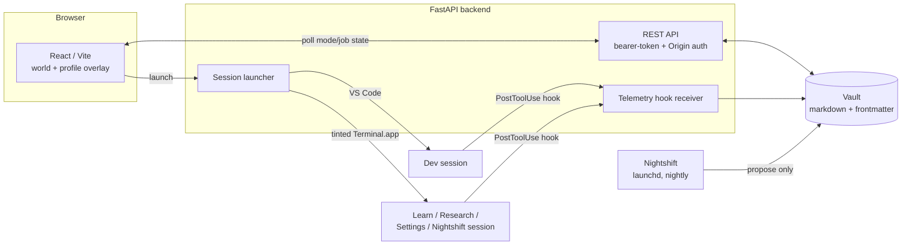

<p align="center">
  
</p>

<h1 align="center">Noctis OS</h1>

<p align="center">
  A harness that shapes how Claude works for me — five modes, one compounding knowledge graph.
</p>

<p align="center">
  
  
  
</p>

---

## What this is

Noctis OS is a harness that shapes how Claude works for me: five modes — build, learn, research, maintain, and an overnight auditor — that all read and write into one compounding knowledge graph, instead of five disconnected chats that each start from zero. It's loosely inspired by Andrej Karpathy's pattern of an LLM-maintained wiki: a durable, structured store that sessions read from and write back into, rather than context that evaporates when the chat closes.

It's deliberately never a finished system. The mode boundary is there so new modes, tools, and models can keep getting absorbed as the space moves, without the whole thing needing a rewrite each time something changes — the same reason it's a harness and not a fixed app.

Concretely: a persistent pixel-art "world" with five characters idling on a dusk backdrop (the screenshot above is the real thing, not a mockup). Each character is a mode with its own methodology, working context, and subagents, all reading and writing the same vault. Click one, see its live state (what's in flight, what's overdue, what's staged for review), and hit launch — that spins up a real Claude Code session in the right surface (VS Code for building, a color-tinted Terminal window for everything else) with that mode's methodology, lessons, and current job context already loaded.

| Character | Mode | What it's for |
|---|---|---|
|  **Faber** | Dev — *build* | Spec → build → ship, the full process gate (plan, implement, review, deploy) |
|  **Noctua** | Learn | Structured study sessions with spaced review |
|  **Vesper** | Research | Sourcing, credibility-checking, and synthesizing findings into durable notes |
|  **Custos** | Settings — *maintain* | Health checks, drift audits, and staged methodology changes for the other four modes |
|  **Echo** | Nightshift — *auditor* | Scheduled, propose-only overnight runs — reviewed and accepted/rejected by hand the next morning |

I use it daily. It's a single-user, single-machine tool — there's no deployment story here by design (see [Architecture](#architecture)). I built it because I was running enough different kinds of Claude Code sessions that "which context do I need to load this time" had become its own daily chore, and wanted mode-switching to be a click instead of a memory exercise. It improves itself over time through proposals I review — never silent changes (see [Two-tier self-improvement](#highlights) below).

## Where this came from

Before Noctis OS, I had one universal `CLAUDE.md` — a single build process file (internally called the "build-spine") that every Claude Code session read, regardless of whether I was actually building software, reading a paper, or triaging settings. It worked fine for dev work and was actively wrong for everything else: a research session would load an entire spec/plan/ship pipeline it had no use for.

The migration was to generalize that one file into five: `build-spine.md` became `modes/dev/dev.md`, and four siblings (`learn.md`, `research.md`, `settings.md`, `nightshift.md`) were written alongside it, each its own methodology rather than a cut-down copy of the dev process. The mechanism that makes this stick per-session is `--append-system-prompt`: every launch passes its own mode's methodology as text. It used to be `CLAUDE_CONFIG_DIR`, pointing the non-dev modes at a private config root — which kept Dev's methodology out but took the plugins, skills, subagents, MCP servers and accumulated permissions with it, since all of those live in the config root too. The global `CLAUDE.md` is the universal prompt now rather than Dev's, so isolation costs nothing and every session gets the full toolkit. One process file turned into five, each addressable independently, without touching how the others load.

## Highlights

- **Per-mode methodology injection.** Every launch assembles that mode's process file + its accumulating lessons file + the specific job's working context into one preloaded session — the orchestration layer that makes each character behave differently. Passed in the argv (`--append-system-prompt`), never inherited from a config file, so identity is a property of the launch rather than of the machine.
- **Every session gets the full toolkit.** Sessions run against the real `~/.claude`, so they inherit installed plugins, skills, subagents, MCP servers, accumulated permissions and memory. Modes differ by methodology, never by capability: a mode handed work it cannot perform ends its turn with nothing done and no way to say so.
- **A capability contract.** Each mode declares what its methodology assumes it can reach; the harness reports what it actually has; `make doctor` prints the gap. Built because `dev.md` mandated seven tools no session could reach — for months, silently.
- **Refusals and silence are visible events.** A turn that ends with tool calls and no text renders as *"turn ended with no reply"*, and one that was refused its tools renders as *"turn ended blocked"* with the refusals named. A blank transcript used to be indistinguishable from a crash.
- **A markdown vault as the only database.** No Postgres, no ORM, no migrations. The backend reads and writes frontmatter'd markdown files directly; state is always inspectable and versionable with plain git.
- **Two-tier self-improvement.** Sessions freely append to a mode's lessons file with no gate (the automatic, low-stakes tier). Periodically, Custos digests those lessons and drafts a *proposed* diff to a mode's actual methodology file, staged for manual accept/reject — no mode ever silently rewrites its own process.
- **Fire-and-forget session telemetry.** A Claude Code hook appends one line per tool call to a per-job log; the interface polls it and shows a live "what's it doing right now" strip under each in-flight job — without the interface ever trying to control or interrupt a running session.
- **A propose-only overnight worker.** Nightshift runs on a schedule, drafts into a staging inbox, and never commits anything itself — every proposal gets reviewed and explicitly accepted or rejected.
- **Design Lodge.** A vault-native, browsable/editable catalog of design assets (components, layouts, palettes, typography, icons, animation patterns) — cross-project, seeded from what's already shipped, checked before Faber reaches for anything new during Plan or Build. A quick-capture inbox (paste a link + a note) gets opportunistically sorted the next time a dev session starts, no context-switch required to file something properly.
- **The hero image above is a real screenshot**, not a mockup or a composite — that's the actual world screen, live backend state and all.

## Architecture

Two local processes and a filesystem — nothing deployed, nothing multi-tenant:


```mermaid
flowchart LR
    subgraph Browser
        UI[React / Vite<br/>world + profile overlay]
    end

    subgraph Backend[FastAPI backend]
        API[REST API<br/>bearer-token + Origin auth]
        Launcher[Session launcher]
        Hooks[Telemetry hook receiver]
    end

    Vault[(Vault<br/>markdown + frontmatter)]
    Nightshift[Nightshift<br/>launchd, nightly]

    UI <-->|poll mode/job state| API
    API <--> Vault
    UI -->|launch| Launcher
    Launcher -->|VS Code| Dev[Dev session]
    Launcher -->|tinted Terminal.app| Other[Learn / Research /<br/>Settings / Nightshift session]
    Dev -->|PostToolUse hook| Hooks
    Other -->|PostToolUse hook| Hooks
    Hooks --> Vault
    Nightshift -->|propose only| Vault
```

- **Backend** — FastAPI, fully stateless. No ORM, no migrations; every endpoint reads or writes vault files on disk and returns state. Auth is bearer-token + Origin checking on every route except `/health`.
- **Frontend** — React + Vite + TypeScript + Tailwind. Polls mode/job state every 15s and renders it as ambient badges — no invented UI-only state, everything shown is a rendering of something the vault already tracks.
- **Vault** — a folder of markdown files with YAML frontmatter, one folder per mode (`modes/<name>/{<name>.md, lessons.md, state.md, jobs/, agents/}`). This is the single source of truth; the backend never holds state the vault doesn't also have. No database also means no migration story to worry about: moving to a new machine is clone the repo, point `VAULT_PATH` at the vault, `make setup` — not a project.
- **Session launcher** — Dev opens VS Code; the other four open a character-tinted `Terminal.app` window. Neither redirects the config root: each passes its own methodology and subagents as flags, so every session inherits the real `~/.claude` and the tools installed there.
- **Telemetry** — a Claude Code `PostToolUse` hook appends one line per tool call to a per-job runtime log (not the vault — high-churn, ephemeral, gitignored). The interface tails that log for the live action strip.
- **Nightshift** — a `launchd`-scheduled job that proposes work into a staging inbox only. Nothing it produces is committed without a human explicitly accepting it in Echo's profile overlay.
- **Desktop wrapper** — `desktop/NoctisOS.app` is a real double-clickable macOS app (`pywebview`), but a thin window around the same live source — a code change just needs the app's own Refresh command, never a rebuild.

## Tech stack

| Layer | Choice |
|---|---|
| Frontend | React 19, TypeScript, Vite, Tailwind CSS 4 |
| Backend | FastAPI, Python 3.11, `python-frontmatter` |
| Storage | Flat markdown + YAML frontmatter (no database) |
| Desktop shell | `pywebview` |
| Scheduling | macOS `launchd` |
| Session runtime | [Claude Code](https://claude.com/claude-code) (CLI), driven via its hooks and per-session config |
| Testing | `pytest` (backend, 37+ tests covering auth, vault I/O, and every router) |

## Running it locally

Requires macOS, Python 3.11+, Node 18+, and the [Claude Code CLI](https://claude.com/claude-code) installed and logged in.

```bash
git clone https://github.com/shaynesss/noctis-os.git
cd noctis-os
make setup     # installs backend + frontend deps, copies .env.example -> .env
```

Fill in `.env` — `VAULT_PATH` (absolute path to a vault folder on your machine) and `NOCTIS_API_TOKEN` (any local secret string; it just has to match between backend and frontend).

```bash
make dev       # backend (FastAPI, :8000) + frontend (Vite, :5180, pinned), browser tab
make open-app  # same thing, opened as a native macOS window instead
```

See [`SETUP.md`](SETUP.md) for the one-time machine checklist (Claude Code login, the nightshift `launchd` job, and a VS Code setting the Dev launch surface needs).

> **Heads up:** this is a genuinely single-user tool — the vault path, launch surfaces, and mode folders all assume it's pointed at *your* Claude Code setup on *your* machine. It's public as a working example of the architecture, not as something meant to run multi-tenant or be deployed anywhere.

## Project layout

```
noctis-os/
├── backend/          FastAPI app — routers, auth, vault I/O, hooks, tests
├── frontend/          React/Vite app — world screen, profile overlays
├── desktop/           pywebview native-window wrapper
├── assets/            Character sprites + world backdrop (source of truth for both apps)
├── launchd/            Nightshift's scheduled-job plist
├── scripts/            setup.sh, nightshift_run.sh
├── SPEC.md            Full spec: Definition / PRD / Technical Design / Design Brief
├── STATUS.md          Live build state — what's shipped, what's smoke-tested
└── SETUP.md           One-time machine setup checklist
```

## Status

**v1.5.2 is shipped and is the working system. v2 is mid-build.**

v1.5 wired all five modes to real vault reads/writes, launched sessions into
VS Code and tinted Terminal windows, streamed live telemetry into the
interface, and added **Design Lodge** — a vault-native catalog of design
assets, cross-project and seeded from what has already shipped.

**v2 replaces Claude Desktop as the entry point.** Rather than launching
sessions into other applications and reading state back, the app hosts them:
it drives Claude Code as a subprocess and streams its output into its own
transcript. That is what makes live session monitoring, cross-mode search and
durable conversation history possible at all — three things v1's
fire-and-forget model could not do. It runs on the existing Claude
subscription with no API billing, which is the constraint the whole
architecture is shaped around.

Working end to end today: the orchestrator (spawn, stream, resume, stop, two
concurrent), the Noctis MCP server, and a Tauri shell with chat, mode entry,
handoff, search and real usage stats. The morning brief, worklist and
scheduler are next.

**Superseded in September 2026, and worth knowing if you read the older
commits or docs:**

| Was | Is |
|---|---|
| Each mode had its own `CLAUDE_CONFIG_DIR` under `backend/launch_config/` | No redirect anywhere. Sessions use the real `~/.claude`, so plugins, skills, subagents, MCP servers, permissions and memory are all inherited |
| A mode's methodology was written into that dir's `CLAUDE.md` on every launch | Passed per launch via `--append-system-prompt`; nothing per-mode is written to disk, so concurrent sessions cannot race |
| `~/.claude/CLAUDE.md` symlinked to `modes/dev/dev.md` | Symlinks to `prompts/system.md`. The config root is infrastructure, never an identity — the old symlink made the machine itself Faber and leaked the build process into every other mode |
| Per-mode tool cages (`--disallowedTools`) restricted research and maintenance modes | Every mode gets the same tools. `git push` stays denied for all of them |
| Permission prompts were emitted with nothing attached to answer them | Answered by the Noctis MCP server, surfaced as a dialog in the app |
| The composer chip cycled the permission mode | It cycles **effort** (`low`/`medium`/`high`/`xhigh`, default high), which `dev.md` had asked for since it was written while no code passed `--effort` |
| The MCP server was built but never attached to a spawn | Attached to every spawn; `vault_search` and the `enter_<mode>` MCP prompts are reachable |
| `make test` ran backend tests only | Runs backend, frontend typecheck and frontend tests. `make doctor` reports what is up, what is down, and any capability gaps |

Full reasoning for each is in [`CHANGELOG.md`](CHANGELOG.md) and the commit
messages; the portability decisions are in the *Harness portability* section
of [`SPEC.md`](SPEC.md).

**[`docs/noctis-documentation.md`](docs/noctis-documentation.md)** is the short read: what
the pieces are and how they fit, in one sitting. See
[`STATUS.md`](STATUS.md) for the detailed, non-aspirational build log and
[`CHANGELOG.md`](CHANGELOG.md) for what changed when.

**Deliberately out of scope:** multi-user support or auth beyond a single
bearer token, any hosted deployment, idle character animation/roaming, and a
full expression-swap library beyond the current busy/idle pair per character.

**Deferred rather than excluded:** a multi-harness adapter. Noctis drives
Claude Code, and the coupling is confined to three files under the
`orchestrator/events.py` seam. An abstraction with one implementation would
encode guesses about the second harness rather than knowledge of it, so the
seam stays and the adapter waits for a real second harness to be built
against. `python -m capabilities --migrate` emits a brief describing
everything that would not port — as intent rather than as settings — for an
agent in another harness to act on. See
[`wiki/Harness Portability.md`](https://github.com/shaynesss/noctis-os) in the
vault and the *Harness portability* section of [`SPEC.md`](SPEC.md).

## License

[MIT](LICENSE) — see the license file for details.
