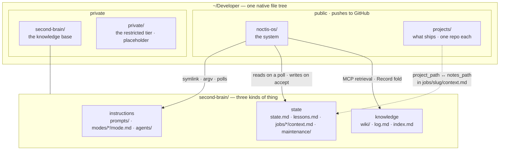
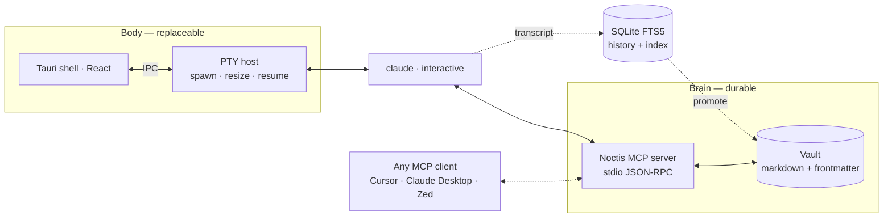

<h1 align="center">Noctis OS</h1>

<p align="center">
  A knowledge vault with a standard protocol in front of it, and an app that runs agents against it.
</p>

<p align="center">
  
  
  
  
</p>

---

> [!WARNING]
> Sessions run with `Bash`, `Edit` and `Write` pre-approved, against your project directory and your vault. Read [Blast radius](#blast-radius) before pointing this at anything you care about.

## The idea

A chat session is disposable. You close the window and the thinking evaporates.

Noctis splits that into two halves that age differently:

**The brain** — a markdown vault, plus a small MCP server that makes it queryable. Ranked retrieval over years of decisions, the working context of every job, and each mode's methodology. It speaks stdio JSON-RPC with no Noctis-specific dependencies, so **anything that speaks MCP can use it**: Claude Desktop, Cursor, Zed, a script.

**The body** — whatever runs the sessions. Today that is a Tauri app hosting the Claude Code CLI in a terminal. It is a vessel. The brain is meant to outlive it.

That split is the whole design. The interface is the replaceable half, and it is built so that replacing it costs a stated amount rather than a rewrite.

## Five modes

They differ by **method**, never by capability. Every mode gets the same tools; what changes is the methodology it reads and the model it runs.

| Mode | For | Model |
|---|---|---|
| **General** | Questions, comparisons, anything unscoped | Opus 5 |
| **Faber** | Build: spec, implement, ship | Opus 5 |
| **Noctua** | Learn: read closely, explain, retain | Opus 5 |
| **Vesper** | Research: gather, weigh, return a verdict | Opus 5 |
| **Maintenance** | Audit the vault and propose repairs | Haiku 4.5 |

A mode is passed into a session in its argv — never inherited from a config file on disk. Varying capability instead was tried, and it produced a mode handed work it could not perform with no way to say so.

## The app, tab by tab

The window is a rail of four tabs beside a terminal area, and it opens on **Repo**. Each tab is a view over state that already exists — the CLI's own transcripts, the vault, git, GitHub — never a second copy of it.

### Terminal

The real interactive `claude`, hosted in a pseudo-terminal and drawn in the app's palette. Sessions:

- **open by saying what they are** — a fresh session gets an opening prompt to state its mode, purpose and directory, so no terminal ever sits at a bare prompt looking like nothing loaded;
- **start where their work is** — General and the vault modes at the vault, Faber in the projects directory (which project is the session's to establish);
- **survive a reload** — the PTY registry lives in the Rust process; the page reattaches with a replay of what each session printed;
- **resume by engine session id**, so a conversation you closed comes back, not a copy that forgot its screen;
- **split** — `⌘⇧-number` puts a tab beside the showing one; a row up to three, then a 2×2, 3×2, 3×3 grid. The tab strip brackets a split's tabs and drags them as one module. Each tab wears its mode's sprite.

`⌘T` opens the launcher (mode, directory, optional opening prompt). `⌘⇧H` hands a conversation off to another mode with a carried summary. `⌘W` closes; `⌘1–9` focus by position.

### Repo

The repositories the open terminals are in, one group per repository, the showing terminal's first — two Faber sessions on one project are one group naming both terminals; a session on another project is a second column.

**The commit log is the memory.** Per repository: branch, ahead/behind, uncommitted files, and the last twenty commits — click one for its body, click again to close it. A commit's body is the record of where that piece of work was left (every session's commits end with *where this leaves things* and *what comes next*), so opening a project is reading where you stopped; there is no separate brief. A red dot is "not on GitHub", a green one "on GitHub", and each commit wears the sprite of **whose work it was** — by evidence: the session whose transcript ran the commit, whatever tab happened to be open; a session filed from inside a dev job's project is Faber's. GitHub's half — open pull requests with a one-word check state, open issues — loads after the local half so the view never waits on the network.

For a dev job's project, a **Record** fold shows the other half of the same work, by file: every file of the project's vault record — the notes folder (`wiki/<Project>/`), the job context, and the shared files a session inside this project last touched (the log entry, the lesson) — each with the commit that last wrote it, a never-committed file first, and one sentence saying how far the record trails the code. The same figures and the same push button as the project, pointed at the vault.

**The push is a button, and it is yours.** A session never pushes (`git push` is denied to hosted sessions; the prompt sends every other one here). The button runs `git push` as your own git identity, reads every outgoing commit first and refuses if any carries an attribution trailer or — for commits dated after 2026-09-17 — has no body, and asks separately before a force push when the histories disagree.

### Stats

The engine's rolling **5-hour and 7-day windows** — the real currency on a subscription; no dollar figure is ever shown as spend — lifetime tokens by kind, a year of activity, and the **history of every session on this machine**, indexed from the transcripts the CLI writes itself. Open a past transcript, search it, or resume it into a terminal. `⌘K` searches history across all modes from anywhere.

### Settings

Three things that are true until you change them. **Maintenance:** nightshift's last run — nightly at 03:00, said as one sentence with how many nights in a row have ended the same way — and the proposals it staged, as packages: the sender's sprite, what the change is, what accepting does, the full rationale, evidence and a red/green diff on demand. **Accepting applies the diff** — all hunks or none — archives the proposal, and commits the vault; rejecting archives it. Maintenance itself never edits a methodology; the person accepting is the edit. A job gone stale becomes a proposal here too, which is how loose ends come back round. **Prompts:** the prompts every session reads — the universal prompt and each mode's overlay — edited in place in the vault (saved uncommitted; the Repo tab commits them). Beside them, the **regression suite**: thirteen cases, each a mode, a prompt and a deterministic assertion guarding one rule — the attribution rule, the Confusion Protocol, plan-before-code, mode identity. Run from the card, scoped to what an edit can affect: an overlay runs its mode's cases, `system.md` runs all of them, and the cost in sessions is stated before the click. Each case keeps its last result against the prompt it ran on, so a result the prompt has since moved past shows as stale rather than as a pass; a failing case reruns once before it counts.

## The file system

Noctis relies on one directory tree, `~/Developer`, and every path it reads is relative to it. It is a native file tree — not an Obsidian vault, though it keeps a linked system's principles (wikilinks, one page per thing, an index) and Obsidian can open it as a viewer. The line at the root is **publish tier**; nothing at the root itself is versioned, so each folder's `README.md` says what it is for.


```mermaid
flowchart TB
    subgraph DEV["~/Developer — one native file tree"]
        direction LR
        subgraph PUB["public · pushes to GitHub"]
            NOS["noctis-os/<br/>the system"]
            PRJ["projects/<br/>what ships · one repo each"]
        end
        subgraph PRV["private"]
            SB["second-brain/<br/>the knowledge base"]
            PV["private/<br/>the restricted tier · placeholder"]
        end
    end
    subgraph SBI["second-brain/ — three kinds of thing"]
        direction LR
        INS["instructions<br/>prompts/ · modes/*/mode.md · agents/"]
        STA["state<br/>state.md · lessons.md · jobs/*/context.md · maintenance/"]
        KNW["knowledge<br/>wiki/ · log.md · index.md"]
    end
    NOS -- "symlink · argv · polls" --> INS
    NOS -- "reads on a poll · writes on accept" --> STA
    NOS -- "MCP retrieval · Record fold" --> KNW
    PRJ -. "project_path ↔ notes_path<br/>in jobs/slug/context.md" .-> STA
    SB --- SBI
```

| Folder | What | Tier | Remote |
|---|---|---|---|
| `noctis-os/` | this repository: the interface, the backend, the MCP server, the nightly runner. Outside `projects/` because it is what reads every other folder, and its path is baked into the launchd plist, Claude Code's per-project memory and `.env`. | public | `shaynesss/noctis-os` |
| `projects/` | one directory and one repo per project that ships; `archive/` for what is finished. The folder itself is unversioned. | public | one per project |
| `second-brain/` | the knowledge base — the brain in the diagram above | private | `shaynesss/second-brain` |
| `private/` | only what cannot sit in `second-brain` at all: third-party confidences, personal reflection. A placeholder until something belongs there. | private | none yet |

**A project is three things that share a name**, and the job context is the join:

| Where | What | Named in |
|---|---|---|
| `projects/<slug>/` | the code | `context.md` as `project_path` |
| `second-brain/wiki/<Title>/` | the record: Overview, Decision Log, Spec, briefs | `context.md` as `notes_path` |
| `second-brain/modes/dev/jobs/<slug>/context.md` | the state: stage, status, where the work was left | — |

A Faber session opened in a project directory receives that job's context in its argv, writes code to the project and the record to the vault, and the Repo view shows both halves under one module: the code's commits, and the record by file.

**Inside `second-brain/`, three kinds of thing**, and the folder says which. *Instructions* the machine hands to sessions: `prompts/system.md` is `~/.claude/CLAUDE.md` by symlink, so every Claude Code session on the machine reads it; a session Noctis hosts also gets its mode's overlay (`prompts/overlays/<mode>.md`, pointing at `modes/<mode>/<mode>.md`), its subagents (`modes/<mode>/agents/`) and the tail of its job context, all in the argv; `maintenance/` is the same shape at the root because maintenance is infrastructure, not a mode. *State* the machine reads and sessions write: `modes/*/state.md`, `lessons.md`, `jobs/*/context.md`, `maintenance/state.md` and `inbox/`. *Knowledge* only sessions and retrieval read: `wiki/` (a folder per project, flat pages for everything else), `log.md`, `index.md`. The schema that decides which is which is the vault's own `CLAUDE.md`.

| Reader | Reads |
|---|---|
| Every Claude Code session on the machine | `prompts/system.md` via the symlink; the `CLAUDE.md` of the directory it opened in |
| A session Noctis hosts, at launch | its overlay, its agents, the tail of its job context — all in the argv |
| A session, because a rule tells it to | its methodology, its `lessons.md`, the vault schema, the job's notes folder |
| The backend, on a poll | `modes/*/state.md`, `lessons.md`, `jobs/*/context.md`, `maintenance/state.md`, `maintenance/inbox/` |
| The nightly runner | `maintenance/schedule.md`, `maintenance/agents/distiller.md`, each mode's declared slack |
| The MCP server's retrieval | every `.md` under `second-brain/` except `eval/` |
| Nobody automated | the vault's `README.md` and `index.md`, `design-lodge/`, `raw/`, `skills/`, `private/` |

## Architecture


```mermaid
flowchart LR
    subgraph Body[Body — replaceable]
        UI[Tauri shell · React]
        PTY[PTY host<br/>spawn · resize · resume]
    end

    subgraph Brain[Brain — durable]
        MCP[Noctis MCP server<br/>stdio JSON-RPC]
        Vault[(Vault<br/>markdown + frontmatter)]
    end

    Store[(SQLite FTS5<br/>history + index)]
    CC[claude · interactive]
    Other[Any MCP client<br/>Cursor · Claude Desktop · Zed]

    UI <-->|IPC| PTY
    PTY <--> CC
    CC <--> MCP
    Other <-.-> MCP
    MCP <--> Vault
    CC -.->|transcript| Store
    Store -.->|promote| Vault
```

The shell hosts `claude` in a pseudo-terminal — the real interactive CLI, rendering itself, in Noctis's own palette. The mode travels in the argv. Sessions resume by engine session id, and history is indexed from the transcripts the CLI writes itself, so it covers every session on the machine. Several run at once; the cap is advisory, a budget on the 5-hour window rather than a resource limit.

It runs on an existing Claude subscription with no API billing, because it drives the vendor's own CLI rather than calling an API with a key.

## The claims, and how to check them

Each of these is verifiable on your own machine rather than taken on trust.

| Claim | Check it |
|---|---|
| The brain works from any MCP client | `python3 backend/mcp/server.py` — stdio JSON-RPC, zero dependencies. Point Cursor or Claude Desktop at it and `vault_search` answers |
| Retrieval is measured, not asserted | `python -m eval.run_retrieval_eval` — 80% recall@20, and the harness imports the same constants the server ships |
| Modes differ by method, not capability | `make doctor` — every mode reports the same tool surface, and any gap between what a methodology assumes and what exists is printed |
| Sessions inherit your real toolkit | No `CLAUDE_CONFIG_DIR` anywhere: `ps eww <pid> \| grep CLAUDE_CONFIG_DIR` finds nothing |
| No API billing | `Limits` reports 5-hour and 7-day windows, never dollars; `list_cost_usd` is documented as notional |
| A session never pushes | `backend/orchestrator/permissions.json` denies `git push`; the Repo tab's button is the only push, and it runs as you |
| A move to another harness has a known cost | `python -m capabilities --migrate` — the brief describing everything that would not port |

## Stack

| Layer | Choice |
|---|---|
| Shell | Tauri 2, React 19, TypeScript, Vite, Tailwind 4 |
| Backend | FastAPI, Python 3.11, no ORM, no migrations |
| Session runtime | [Claude Code](https://claude.com/claude-code) CLI, interactive, in a pseudo-terminal |
| Durable state | Markdown + YAML frontmatter |
| History + retrieval | SQLite FTS5 (BM25), no added dependencies |
| Testing | `pytest` + `vitest` + `tsc -b`, Playwright for the screens |

## Quickstart

macOS · Python 3.11+ · Node 18+ · Claude Code CLI installed and logged in.

```bash
git clone https://github.com/shaynesss/noctis-os.git
cd noctis-os
make setup     # deps, and .env.example -> .env
```

Set `VAULT_PATH`, `NOCTIS_API_TOKEN` and `VITE_API_TOKEN` in `.env`. Everything else has a working default — see [DOCUMENTATION.md](DOCUMENTATION.md#configuration) for the full table.

```bash
make dev       # the app: Tauri window, supervised backend, typecheck
make browser   # backend-only work: browser tab, hot reload, no Rust build
make doctor    # what is up, what is down, any capability gaps
make test      # pytest + tsc -b + vitest
```

**You develop in the window you use.** `make dev` is the app — a native Tauri
window — so a bug found while working is a bug found in the real surface.
`make browser` is the fallback for backend-only work, where a Rust build is
not worth paying for; it swaps the window for a browser tab and the supervisor
for a file-watching reloader, which are alternatives rather than layers.

## Blast radius

**Sessions have full tool access.** `Bash`, `Edit`, `Write`, `Read`, `WebSearch`, `WebFetch` — pre-approved, no prompt. A session can run any shell command and edit any file it can reach.

**`git push` is denied outright.** Commits happen; pushing is yours, from the Repo tab or a terminal of your own.

**Two reachable directories:** the launched project, and `VAULT_PATH`. The engine sandboxes file access to those.

**It writes to your vault** — lessons, job contexts, staged proposals. Keep the vault in git so you can see and revert. Accepting a proposal (Settings → Maintenance) commits the vault; nothing else does.

**And outside it:** `backend/data/` (SQLite) and `backend/runtime/` (action logs), both gitignored.

**`bootstrap.sh` modifies the machine**, not just the repo — a `launchd` job for nightshift, and `.env` if absent. `./bootstrap/bootstrap.sh --dry-run` shows exactly what it would do first.

## Status

**v2 is the daily driver.** Stage 1 complete; Stage 2 items 1–9 closed, and nothing is left in the build order — the `launchd`-on-wake scheduler that was item 6's last piece was closed on 2026-09-15 rather than built, because the commit log is the record. v1 is gone.

| | |
|---|---|
| **v2 terminal** (2026-09-13/14) | The app hosts the real interactive CLI in a PTY instead of driving `claude -p` per turn. Sessions survive a reload, split into a grid, and wear their mode. |
| **v2** (2026-09) | The app hosts sessions instead of launching them into VS Code and Terminal. Durable history, cross-mode search. |
| **v1 cutover** (2026-09-12) | v1 removed entirely; maintenance's state moved to root-level `maintenance/`; the backend supervises itself. |
| **v1.5** (2026-07) | Five modes wired to real vault reads and writes; Design Lodge. |

Full detail in [DOCUMENTATION.md](DOCUMENTATION.md) · [`STATUS.md`](STATUS.md) · [`CHANGELOG.md`](CHANGELOG.md).

## Documentation

- **[DOCUMENTATION.md](DOCUMENTATION.md)** — the reference. Every subsystem, the session lifecycle, prompts vs config, the MCP surface, retrieval, portability, troubleshooting.
- [`STATUS.md`](STATUS.md) — what works today.
- [`CHANGELOG.md`](CHANGELOG.md) — what changed, and why.
- [`SETUP.md`](SETUP.md) — one-time machine checklist.

**Two sides to every project, and two places they commit.** What a contributor needs to run and change the code — this README, `DOCUMENTATION.md`, `STATUS.md`, `CHANGELOG.md`, `SETUP.md`, `CLAUDE.md` — lives here, in the public repository, and is written to be safe to push: no secrets, no private reasoning, every decision a contributor would need. The *record* of building it — the spec, design brief, migration records, open questions, the daily log and the lessons — lives in the private vault at the project's notes path (`second-brain/wiki/Noctis OS/`), and commits there. A Faber session working on this repository writes to both, each in its own commit; the Repo tab shows the vault side beneath the project as **Record**, so both halves of one piece of work are one view. The rule, from `CLAUDE.md`: the repo's docs carry every decision a contributor needs and nothing that is only the build's own reasoning.

**Single-user by design.** No multi-tenancy, no hosted deployment, no auth beyond one bearer token. Public as a working example of the architecture.

## License

[MIT](LICENSE)
