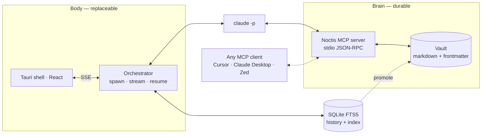

<h1 align="center">Noctis OS</h1>

<p align="center">
  A knowledge vault with a standard protocol in front of it, and an app that runs agents against it.
</p>

<p align="center">
  
  
  
  
</p>

---

> [!WARNING]
> Sessions run with `Bash`, `Edit` and `Write` pre-approved, against your project directory and your vault. Read [Blast radius](#blast-radius) before pointing this at anything you care about.

## The idea

A chat session is disposable. You close the window and the thinking evaporates.

Noctis splits that into two halves that age differently:

**The brain** — a markdown vault, plus a small MCP server that makes it queryable. Ranked retrieval over years of decisions, the working context of every job, and each mode's methodology. It speaks stdio JSON-RPC with no Noctis-specific dependencies, so **anything that speaks MCP can use it**: Claude Desktop, Cursor, Zed, a script.

**The body** — whatever runs the sessions. Today that is a Tauri app driving the Claude Code CLI as a subprocess. It is a vessel. The brain is meant to outlive it.

That split is the whole design. The interface is the replaceable half, and it is built so that replacing it costs a stated amount rather than a rewrite.

## Five modes

They differ by **method**, never by capability. Every mode gets the same tools; what changes is the methodology it reads and the model it runs.

| Mode | For | Model |
|---|---|---|
| **General** | Questions, comparisons, anything unscoped | Opus 5 |
| **Faber** | Build: spec, implement, ship | Opus 5 |
| **Noctua** | Learn: read closely, explain, retain | Opus 5 |
| **Vesper** | Research: gather, weigh, return a verdict | Opus 5 |
| **Maintenance** | Audit the vault and propose repairs | Haiku 4.5 |

A mode is passed into a session in its argv — never inherited from a config file on disk. Varying capability instead was tried, and it produced a mode handed work it could not perform with no way to say so.

## Architecture


```mermaid
flowchart LR
    subgraph Body[Body — replaceable]
        UI[Tauri shell · React]
        Orch[Orchestrator<br/>spawn · stream · resume]
    end

    subgraph Brain[Brain — durable]
        MCP[Noctis MCP server<br/>stdio JSON-RPC]
        Vault[(Vault<br/>markdown + frontmatter)]
    end

    Store[(SQLite FTS5<br/>history + index)]
    CC[claude -p]
    Other[Any MCP client<br/>Cursor · Claude Desktop · Zed]

    UI <-->|SSE| Orch
    Orch <--> CC
    CC <--> MCP
    Other <-.-> MCP
    MCP <--> Vault
    Orch <--> Store
    Store -.->|promote| Vault
```

The orchestrator spawns `claude -p --output-format stream-json`, normalises the event stream, and streams it to the shell. Sessions resume by engine session id. Two run concurrently — a budget on the 5-hour window, not a resource limit.

It runs on an existing Claude subscription with no API billing, because it drives the vendor's own CLI rather than calling an API with a key.

## The claims, and how to check them

Each of these is verifiable on your own machine rather than taken on trust.

| Claim | Check it |
|---|---|
| The brain works from any MCP client | `python3 backend/mcp/server.py` — stdio JSON-RPC, zero dependencies. Point Cursor or Claude Desktop at it and `vault_search` answers |
| Retrieval is measured, not asserted | `python -m eval.run_retrieval_eval` — 80% recall@20, and the harness imports the same constants the server ships |
| Modes differ by method, not capability | `make doctor` — every mode reports the same tool surface, and any gap between what a methodology assumes and what exists is printed |
| Sessions inherit your real toolkit | No `CLAUDE_CONFIG_DIR` anywhere: `ps eww <pid> \| grep CLAUDE_CONFIG_DIR` finds nothing |
| No API billing | `Limits` reports 5-hour and 7-day windows, never dollars; `list_cost_usd` is documented as notional |
| A move to another harness has a known cost | `python -m capabilities --migrate` — the brief describing everything that would not port |

## Stack

| Layer | Choice |
|---|---|
| Shell | Tauri 2, React 19, TypeScript, Vite, Tailwind 4 |
| Backend | FastAPI, Python 3.11, no ORM, no migrations |
| Session runtime | [Claude Code](https://claude.com/claude-code) CLI as a subprocess |
| Durable state | Markdown + YAML frontmatter |
| History + retrieval | SQLite FTS5 (BM25), no added dependencies |
| Testing | `pytest` + `vitest` + `tsc -b` |

## Quickstart

macOS · Python 3.11+ · Node 18+ · Claude Code CLI installed and logged in.

```bash
git clone https://github.com/shaynesss/noctis-os.git
cd noctis-os
make setup     # deps, and .env.example -> .env
```

Set `VAULT_PATH`, `NOCTIS_API_TOKEN` and `VITE_API_TOKEN` in `.env`. Everything else has a working default — see [DOCUMENTATION.md](DOCUMENTATION.md#configuration) for the full table.

```bash
make dev       # the app: Tauri window, supervised backend, typecheck
make browser   # backend-only work: browser tab, hot reload, no Rust build
make doctor    # what is up, what is down, any capability gaps
make test      # pytest + tsc -b + vitest
```

**You develop in the window you use.** `make dev` is the app — a native Tauri
window — so a bug found while working is a bug found in the real surface.
`make browser` is the fallback for backend-only work, where a Rust build is
not worth paying for; it swaps the window for a browser tab and the supervisor
for a file-watching reloader, which are alternatives rather than layers.

## Blast radius

**Sessions have full tool access.** `Bash`, `Edit`, `Write`, `Read`, `WebSearch`, `WebFetch` — pre-approved, no prompt. A session can run any shell command and edit any file it can reach.

**`git push` is denied outright.** Commits happen; pushing is always manual.

**Two reachable directories:** the launched project, and `VAULT_PATH`. The engine sandboxes file access to those.

**It writes to your vault** — lessons, job contexts, staged proposals. Keep the vault in git so you can see and revert. Nothing is committed for you.

**And outside it:** `backend/data/` (SQLite) and `backend/runtime/` (action logs, gitignored).

**`bootstrap.sh` modifies the machine**, not just the repo — config directories, a `launchd` job, telemetry hooks. `./bootstrap/bootstrap.sh --dry-run` shows exactly what it would do first.

**Every working turn spends a second short spawn** to produce its closing summary. Free on a subscription; roughly double the notional cost on metered billing.

## Status

**v2 is the system.** Stage 1 complete; Stage 2 items 1–5, 7, 8 and 9 closed, item 6 outstanding on its `launchd`-on-wake scheduler.

**v1 is gone.** The 2026-09-12 cutover removed its world screen, launch surfaces, four routers and every mode config directory, and moved maintenance's state to root-level `maintenance/`. The only feature left in the build order is the `launchd`-on-wake scheduler.

### Major revisions

| | |
|---|---|
| **v2** (2026-09) | The app hosts sessions instead of launching them into VS Code and Terminal. Live transcripts, durable history, cross-mode search — none of which the fire-and-forget model could do. |
| **v2 harness pass** (2026-09-11/12) | Sessions run against the real `~/.claude` rather than private config directories, so they inherit the full toolkit. Per-mode tool cages removed. Turn integrity made visible and enforced. |
| **v1 cutover** (2026-09-12) | v1 removed entirely — world screen, launch surfaces, four routers, config dirs, and the pywebview shell the `app` target was still pointing at. Maintenance's state moved out of `modes/` to root-level `maintenance/`. The backend is supervised: it restarts itself when it stops answering. |
| **v1.5** (2026-07) | Five modes wired to real vault reads and writes; Design Lodge. |

Full detail in [DOCUMENTATION.md](DOCUMENTATION.md) · [`STATUS.md`](STATUS.md) · [`CHANGELOG.md`](CHANGELOG.md).

## Documentation

- **[DOCUMENTATION.md](DOCUMENTATION.md)** — the reference. Every subsystem, the session lifecycle, prompts vs config, the MCP surface, retrieval, portability, troubleshooting.
- [`SPEC.md`](SPEC.md) — constraints and locked decisions.
- [`STATUS.md`](STATUS.md) — what works today.
- [`SETUP.md`](SETUP.md) — one-time machine checklist.

**Single-user by design.** No multi-tenancy, no hosted deployment, no auth beyond one bearer token. Public as a working example of the architecture.

## License

[MIT](LICENSE)
